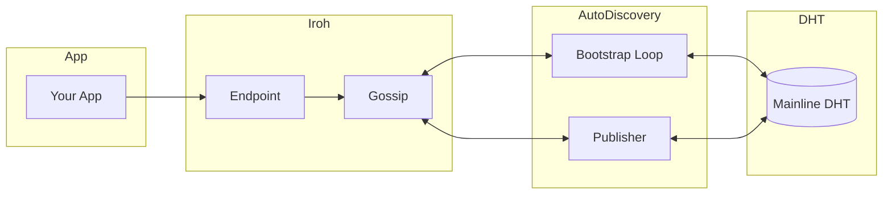
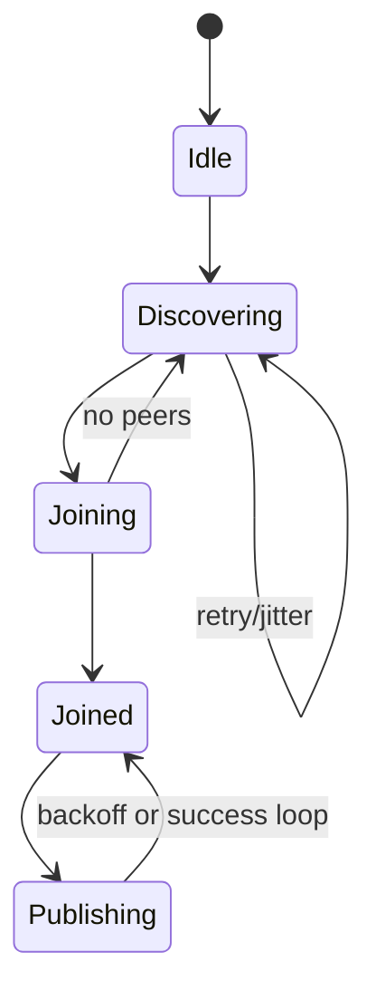
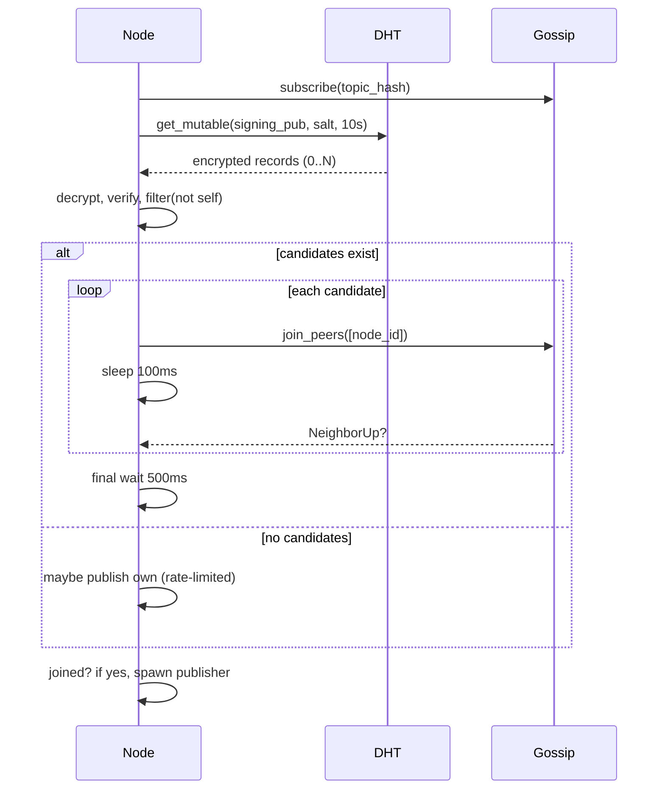
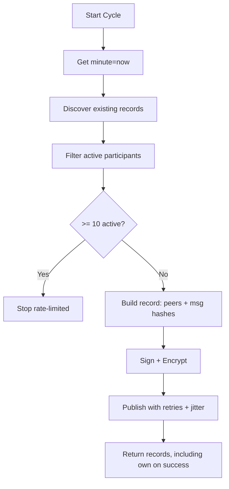
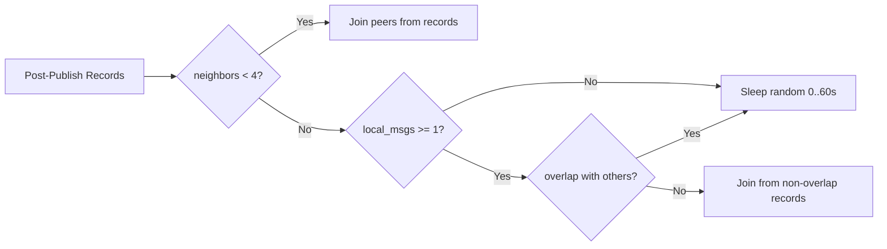
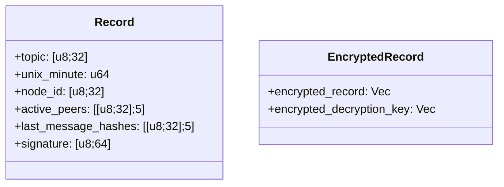
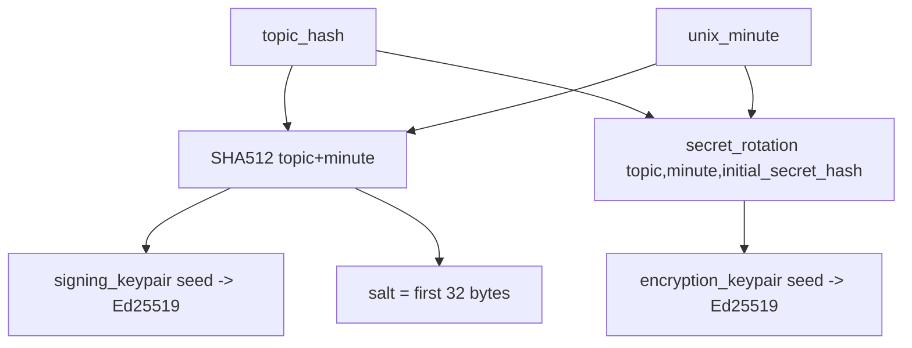

# Architecture

This document explains how the library operates. It complements the spec
(PROTOCOL.md) with high-level structure, data flows, and failure handling.

Contents:
- System overview
- Bootstrapping
- Publishing
- Bubble detection and merging
- Data model
- Failure modes
- Tuning

## System overview

Components:
- iroh endpoint and gossip
- Auto-discovery (bootstrap loop)
- Publisher (background task)
- DHT client (mutable records)
- Crypto (signing, encryption, secret rotation)



Node lifecycle:
- Start iroh endpoint
- Start gossip
- Auto-discovery:
  - Join topic, attempt bootstrap, connect
  - Spawn publisher on success

State machine:



## Bootstrapping

Goal: connect to at least one topic peer.

Sequence:



Key points:
- First iteration: also check previous unix minute.
- Pacing avoids bursts and “bubbles.”
- Keep trying until joined.

Pseudocode:

```text
loop:
  if joined(): return sender, receiver

  minute = first_attempt ? -1 : 0
  recs = get_unix_minute_records(minute)

  if recs.is_empty():
    maybe_publish_this_minute()
    sleep(100ms)
    continue

  for peer in extract_bootstrap_nodes(recs):
    if joined(): break
    join_peer(peer)
    sleep(100ms)

  sleep(500ms)
  if joined(): return
  maybe_publish_this_minute()
  sleep(100ms)
```

## Publishing

Goal: publish active participation without overloading DHT.

Flow:



Pseudocode:

```text
records = get_unix_minute_records(now)
active = filter_active(records)
if active.len >= 10: return records

rec = make_record(neighbors(<=5), last_hashes(<=5))
enc = encrypt(sign(rec))
publish_with_retry(enc, retries=3, jitter=0..2000ms)
return records + [rec_if_success]
```

## Bubble detection and merging

Signal 1: small cluster \(neighbors < 4\).
- Extract peer ids from discovered records.
- Exclude zeros, self, current neighbors.
- Join up to MAX_JOIN_PEERS_COUNT.

Signal 2: non-overlapping message sets.
- Compare local last_message_hashes with others.
- If disjoint, collect publisher + peers from those records.
- Attempt joins to bridge partitions.

Decision graph:



## Data model

Record (summary):
- topic hash (32)
- unix_minute (u64)
- node_id (publisher)
- active_peers[5] (node ids)
- last_message_hashes[5]
- signature (64)

EncryptedRecord:
- encrypted_record (Vec)
- encrypted_decryption_key (Vec)

Diagram:



Key derivation:



## Failure modes

- DHT get timeout:
  - Return empty set; continue loop.
- Decrypt/verify failure:
  - Drop record; proceed.
- Publish failure:
  - Exponential backoff (1..60 s), then retry.
- Join failure:
  - Continue to next peer; final 500 ms wait; loop.

## Tuning

- Per-minute cap \(N_{active} \ge 10\) gates publishing.
- Pacing (100 ms) reduces bursts.
- Backoff (1..60 s) stabilizes DHT load.
- Message window size (5 peers, 5 hashes) is a trade-off:
  - Larger window = better visibility, larger records.
  - Smaller window = lower bandwidth, less overlap detection.

Parameters:
- MAX_BOOTSTRAP_RECORDS
- MAX_JOIN_PEERS_COUNT
- DHT timeout
- Retry count and jitter
- Join pacing and final wait
- Publisher backoff and success jitter