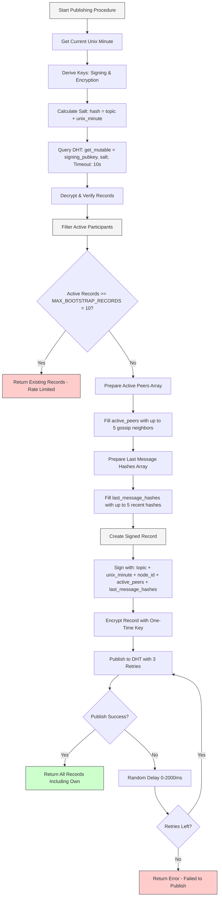
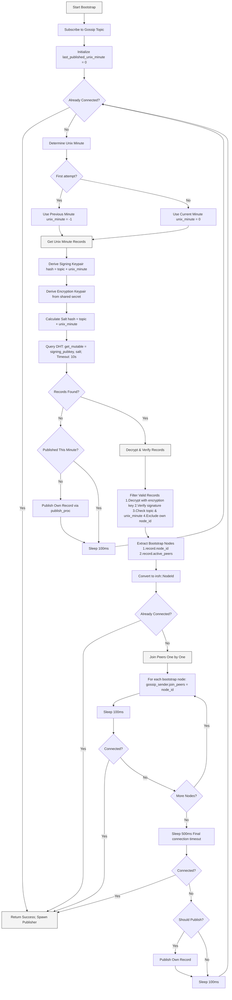
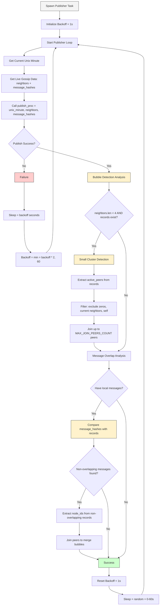
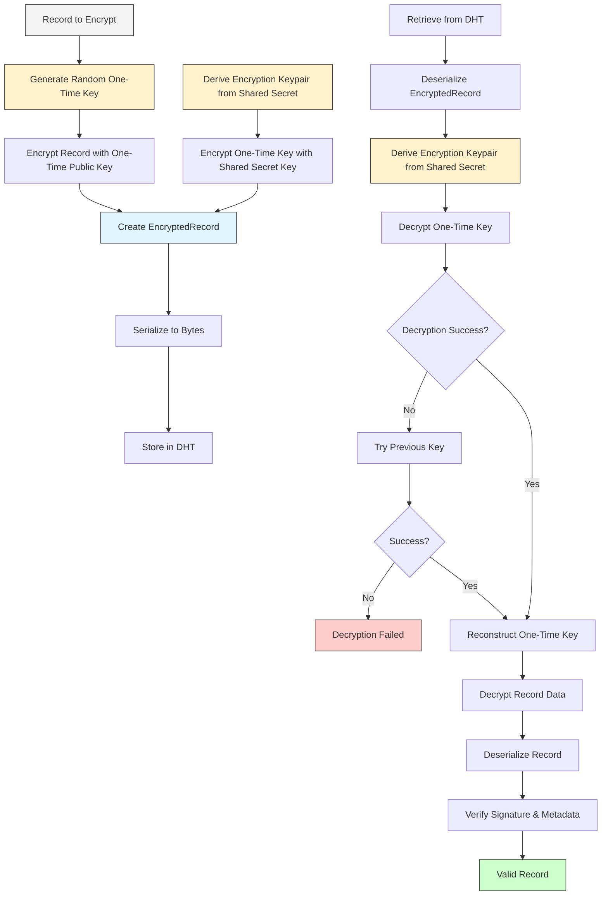

# Distributed Topic Tracker Experimentation

The distributed topic tracker crate implements the below specified protocol for automatic bootstrapping for iroh nodes trying to join [iroh-gossip](https://github.com/n0-computer/iroh-gossip) topics. 

This is the second iteration of topic tracker developed, this time **fully decentralized** purly relying on the mainline crate (implementing the bittorrent dht) and native ed25519 key derivation, signing and encryption. Without any centralized components.

(see [iroh-topic-tracker](https://github.com/rustonbsd/iroh-topic-tracker) for a similary fully integrated but centralized iroh-gossip auto bootstrap crate)

### Example usage
```rust
use anyhow::Result;
use iroh::{Endpoint, SecretKey};
use iroh_gossip::{api::Event, net::Gossip};

// import the p01 module from this crate
use distributed_topic_tracker_exp::p01::{
    AutoDiscoveryBuilder, AutoDiscoveryGossip, DefaultSecretRotation, P01TopicId,
};

#[tokio::main]
async fn main() -> Result<()> {

    // Generate a new random secret key
    let secret_key = SecretKey::generate(rand::rngs::OsRng);

    // Set up endpoint with discovery enabled
    let endpoint = Endpoint::builder()
        .secret_key(secret_key)
        .discovery_n0()
        .bind()
        .await?;

    // Initialize gossip with auto-discovery
    let gossip = Gossip::builder()
        .spawn_with_auto_discovery::<DefaultSecretRotation>(endpoint.clone(), None)
        .await?;

    // Set up protocol router
    let _router = iroh::protocol::Router::builder(endpoint.clone())
        .accept(iroh_gossip::ALPN, gossip.gossip.clone())
        .spawn();

    let topic_id = P01TopicId::new("my-iroh-gossip-topic".to_string());
    let initial_secret = b"my-initial-secret".to_vec();

    // Split into sink (sending) and stream (receiving)
    // both are clonable
    let (sink, mut stream) = gossip
        .subscribe_and_join_with_auto_discovery(topic_id, &initial_secret)
        .await?
        .split();
```

If you have tested this crate and it worked for you or you had any issues, I would love your feedback.
Please just drop a comment in the following issue with something that worked or something that didn't!
Any feedback is helpful: [https://github.com/rustonbsd/distributed-topic-tracker-exp/issues/5](https://github.com/rustonbsd/distributed-topic-tracker-exp/issues/5)


---


## Publishing procedure (refined implementation)

The publishing procedure is a rate-limited mechanism that prevents DHT overload while ensuring active participation in the gossip network. `publish_proc` function in `p01_refined.rs`:

- `MAX_BOOTSTRAP_RECORDS`: 10 (maximum active participant records allowed per unix minute)
- DHT timeout: 10 seconds for get_mutable operations
- Retry count: 3 attempts for DHT publishing operations
- Random delay: 0-2000ms between retry attempts

### Publishing Procedure

1. **Record Discovery**
   - Call `get_unix_minute_records()` to fetch, decrypt, and verify existing records for the current unix minute
   - Use the same key derivation as bootstrap:
     - Derive signing keypair: `keypair_seed = hash(topic + unix_minute)`
     - Derive encryption keypair: `enc_keypair_seed = secret_rotation_function.get_unix_minute_secret(topic, unix_minute, initial_secret_hash)`
     - Calculate salt: `salt = hash(topic + unix_minute)`
     - Query DHT: `get_mutable(signing_pubkey, salt)` with 10s timeout

2. **Active Participant Filtering**
   - Filter records to include only "active participants" - records that have:
     - Non-zero entries in `active_peers[5]` array, OR
     - Non-zero entries in `last_message_hashes[5]` array
   - This ensures only nodes actively participating in gossip are counted and network *Bubbles* are detected based on the `last_message_hashes` and merged.

3. **Rate Limiting Check**
   - If `active_participant_records.len() >= MAX_BOOTSTRAP_RECORDS` (10):
     - **Do not publish** - return existing records to prevent DHT overload
     - This implements the core rate limiting mechanism

4. **Record Creation** (if under limit)
   - Prepare `active_peers[5]` array:
     - Fill with up to 5 current iroh-gossip neighbors
     - Remaining slots filled with zeros `[0; 32]`
   - Prepare `last_message_hashes[5]` array:
     - Fill with up to 5 recent message hashes for proof of relay
     - Remaining slots filled with zeros `[0; 32]`

5. **Record Signing and Publishing**
   - Create signed record using `Record::sign()`:
     - Include: `topic_hash`, `unix_minute`, `node_id`, `active_peers`, `last_message_hashes`
     - Sign with node's ed25519 signing key (`iroh::NodeId`)
   - Encrypt record using one-time encryption key
   - Publish to DHT via `publish_unix_minute_record()` with 3 retry attempts

6. **Error Handling**
   - DHT timeouts return empty record sets (non-fatal)
   - Failed record decryption/verification are ignored
   - Random delays between retries prevent synchronized access patterns

### Publishing Flow Diagram



## Bootstrap procedure (refined implementation)

The bootstrap procedure is a continuous loop that attempts to discover and connect to existing nodes in the gossip network. Here's the detailed flow based on the `p01_refined.rs` implementation:

- `MAX_JOIN_PEERS_COUNT`: maximum peers to attempt joining
- `MAX_BOOTSTRAP_RECORDS`: maximum records allowed per unix minute
- DHT timeout: 10 seconds for get_mutable operations
- Connection retry delay: 100ms between attempts
- Final connection check delay: 500ms

### Bootstrap Loop

1. **Initial Setup**
   - Subscribe to the gossip topic using `topic_id.hash`
   - Initialize `last_published_unix_minute = 0` to track publishing state
   - Enter the main bootstrap loop

2. **Connection Check**
   - Check if already connected to at least one gossip peer via `gossip_receiver.is_joined()`
   - If connected, return successfully with gossip sender/receiver pair

3. **Time Window Selection**
   - On first attempt: check previous unix minute (`unix_minute(-1)`)
   - On subsequent attempts: check current unix minute (`unix_minute(0)`)
   - This ensures we reliably discover existing gossip network records on the first try

4. **Record Discovery**
   - Call `get_unix_minute_records()` to fetch, decrypt, and verify records:
     - Derive signing keypair: `keypair_seed = hash(topic + unix_minute)`
     - Derive encryption keypair: `enc_keypair_seed = secret_rotation_function.get_unix_minute_secret(topic, unix_minute, initial_secret_hash)`
     - Calculate salt: `salt = hash(topic + unix_minute)`
     - Query DHT: `get_mutable(signing_pubkey, salt)` with 10s timeout
     - Decrypt each record using the encryption keypair
     - Verify signature, unix_minute, and topic hash
     - Filter out own records (matching node_id)

5. **If no valid Records Found**
   - If no valid records found, attempt to publish own record via `publish_proc()`
   - Only publish if haven't published in this unix minute
   - Sleep 100ms and continue loop

6. **else if valid Records Found**
   - Extract bootstrap nodes from records:
     - Include `record.node_id` (the publisher)
     - Include all non-zero entries from `record.active_peers[5]`
   - Convert byte arrays to valid `iroh::NodeId` instances

7. **Connection Attempts**
   - Check again if already connected (someone might have connected to us)
   - If not connected, attempt to join peers one by one:
     - Call `gossip_sender.join_peers(vec![node_id])` for each bootstrap node
     - Sleep 100ms between attempts to minimize disruption
     - Break early if connection established
     - (findings showed connecting more too many nodes at once can cause the formation of netowrk *Bubbles*, isolated subnetworks that are not connected to the main network)

8. **Final Connection Verification**
   - If still not connected, wait 500ms for iroh-gossip connection timeout
   - Check `gossip_receiver.is_joined()` one final time
   - If connected: return successfully; spawn publisher task
   - If not connected: attempt to publish own record (if not done this minute)
   - Sleep 100ms and continue loop

### Error Handling
- DHT timeouts return empty record sets (non-fatal)
- Failed record decryption/verification are treated as invalid records and ignored
- Failed peer connections don't interrupt the process
- Publishing failures don't prevent continued bootstrapping

### Bootstrap Flow Diagram




## Spawn Publisher (refined implementation)

The Publisher is a background task that runs continuously after successful bootstrap to maintain topic presence on the DHT and detect/merge network *Bubbles*. `spawn_publisher` function in `p01_refined.rs`:

- `MAX_JOIN_PEERS_COUNT`: maximum peers to attempt joining during bubble merging
- Backoff mechanism: starts at 1 second, doubles on failure, caps at 60 seconds
- Random sleep interval: 0-60 seconds between successful publishing cycles
- Bubble detection threshold: less than 4 neighbors or non overlapping messages indicates potential network isolation

### Publisher Loop

1. **Initialization**
   - Spawned as a background task after successful bootstrap
   - Receives cloned gossip sender/receiver, topic configuration, and signing key
   - Initializes exponential backoff counter starting at 1 second

2. **Publishing Cycle**
   - Get current unix minute: `unix_minute(0)`
   - Call `publish_proc()` with live gossip data:
     - Current neighbors from `gossip_receiver.neighbors()`
     - Recent message hashes from `gossip_receiver.last_message_hashes()`
   - This ensures published records contain real-time gossip network state

3. **Bubble Detection and Merging**

   **Small Cluster Detection:**
   - If `neighbors.len() < 4` AND valid records exist:
     - Extract node IDs from `record.active_peers` in discovered records
     - Filter out: zero entries, current neighbors, own node ID
     - Attempt to join up to `MAX_JOIN_PEERS_COUNT` (100) new peers
     - This helps merge small isolated clusters back into the main network

   **Message Overlap Analysis:**
   - If local node has received messages (`last_message_hashes.len() >= 1`):
     - Compare local message hashes with `record.last_message_hashes` from other nodes
     - Identify records with non-overlapping message sets (potential bubble or stale node indicator)
     - Extract all node IDs (publisher + active_peers) from non-overlapping records
     - Attempt to join these peers to merge network bubbles

4. **Error Handling and Backoff**
   - On `publish_proc()` failure:
     - Sleep for current backoff duration (1, 2, 4, 8, ..., 60 seconds)
     - Double backoff duration, capped at 60 seconds
     - Continue loop (retry publishing)

5. **Success Handling**
   - On successful publishing:
     - Reset backoff to 1 second
     - Sleep for random duration: 0-60 seconds
     - Continue loop

### Network Bubble Detection Logic

The publisher implements two bubble detection mechanisms:

1. **Cluster Size Analysis**: Small neighbor counts (< 4) suggest network fragmentation
2. **Message Flow Analysis**: Non-overlapping message hashes indicate isolated subnetworks or stale nodes

When bubbles are detected, the publisher proactively attempts to join peers from other network segments to restore connectivity.

### Publisher Flow Diagram




## Record structure (refined implementation)

```rust
// 489 bytes total (S=5)
#[derive(Debug, Clone, PartialEq, Eq, Hash)]
pub struct Record {
    // Record Content
    topic: [u8; 32],                    // sha512(topic_string)[..32]
    unix_minute: u64,                   // floor(unixtime / 60)
    node_id: [u8; 32],                  // publisher ed25519 public key
    active_peers: [[u8; 32]; 5],        // 5 node ids of active gossip peers
    last_message_hashes: [[u8; 32]; 5], // 5 recent message hashes for proof of relay

    // Record Signature
    signature: [u8; 64],                // ed25519 signature over above fields
                                        // signed by the publisher's ed25519 private key
}

// Variable size (>= 493 bytes at S=5)
#[derive(Debug, Clone)]
pub struct EncryptedRecord {
    encrypted_record: Vec<u8>,          // encrypted Record using one-time key
    encrypted_decryption_key: Vec<u8>,  // one-time decryption key encrypted with
                                        // shared secret derived encryption key
}
```

## Verification (refined implementation)

The `Record::verify()` method performs the following checks:

1. **Topic Verification**: Verify `record.topic` matches the expected topic hash
2. **Time Verification**: Verify `record.unix_minute` matches the unix minute used for key derivation
3. **Signature Verification**:
   - Extract signature data: all record bytes except the last 64 bytes (signature)
   - Signature data includes: `topic + unix_minute + node_id + active_peers + last_message_hashes`
   - Verify ed25519 signature using `record.node_id` as the public key
   - Use `verify_strict()` for enhanced security

### Additional Filtering
- **Decryption validation**: Records that fail decryption with the shared secret are rejected
- **Encoding validation**: Records that fail to decode from bytes are rejected

## Encryption, Decryption

A one-time key encryption scheme is used to protect record content while allowing authorized nodes to decrypt using a shared secret. The system uses a hybrid approach combining Ed25519 key derivation with HPKE encryption.

### Key Derivation

**Signing Keypair (Public DHT Discovery):**
- Purpose: Used for DHT mutable record signing and salt calculation
- Derivation: `signing_keypair_seed = SHA512(topic_hash + unix_minute)[..32]`
- Key: `ed25519_dalek::SigningKey::from_bytes(signing_keypair_seed)`
- Public: This keypair is deterministic and publicly derivable

**Encryption Keypair (Shared Secret Based):**
- Purpose: Used to encrypt/decrypt the one-time keys
- Derivation: `encryption_keypair_seed = secret_rotation_function.get_unix_minute_secret(topic_hash, unix_minute, initial_secret_hash)`
- Key: `ed25519_dalek::SigningKey::from_bytes(encryption_keypair_seed)`
- Private: Only nodes with the shared secret can derive this keypair

**Salt Calculation:**
- Purpose: Used as salt parameter for DHT mutable record storage
- Derivation: `salt = SHA512(topic_hash + unix_minute)[..32]`

### Encryption Process

1. **Generate One-Time Key**
   - Create random Ed25519 signing key: `one_time_key = ed25519_dalek::SigningKey::generate(rng)`
   - Extract public key: `one_time_public_key = one_time_key.verifying_key()`

2. **Encrypt Record Data**
   - Serialize record to bytes: `record_bytes = record.to_bytes()`
   - Encrypt with one-time public key: `encrypted_record = one_time_public_key.encrypt(record_bytes)`

3. **Encrypt One-Time Key**
   - Get one-time key bytes: `one_time_key_bytes = one_time_key.to_bytes()`
   - Derive encryption keypair from shared secret (see Key Derivation above)
   - Encrypt one-time private key: `encrypted_decryption_key = encryption_keypair.verifying_key().encrypt(one_time_key_bytes)`

4. **Create Encrypted Record**
   ```rust
   EncryptedRecord {
       encrypted_record: encrypted_record,
       encrypted_decryption_key: encrypted_decryption_key,
   }
   ```

### Decryption Process

1. **Decrypt One-Time Key**
   - Derive encryption keypair from shared secret (same as encryption)
   - Attempt decryption: `one_time_key_bytes = encryption_keypair.decrypt(encrypted_decryption_key)`
   - Fallback to previous key if rotation occurred: `last_decryption_key.decrypt(encrypted_decryption_key)`
   - Reconstruct one-time key: `one_time_key = ed25519_dalek::SigningKey::from_bytes(one_time_key_bytes)`

2. **Decrypt Record Data**
   - Decrypt record: `decrypted_record_bytes = one_time_key.decrypt(encrypted_record)`
   - Deserialize: `record = Record::from_bytes(decrypted_record_bytes)`

3. **Verify Record**
   - Verify topic hash, unix_minute, and ed25519 signature (see Verification section)

### Encoding Format

**EncryptedRecord Serialization:**
```
[4 bytes: encrypted_record_length (little-endian u32)]
[variable: encrypted_record data]
[variable: encrypted_decryption_key data]
```

### Security Properties

- **Forward Secrecy**: One-time keys are generated randomly for each record
- **Access Control**: Only nodes with the shared secret can decrypt records
- **Key Rotation**: Supports fallback to previous encryption keys during rotation
- **Replay Protection**: Unix minute coupling prevents replay attacks
- **Public Discovery**: DHT discovery remains public while content stays private

### Encryption/Decryption Flow Diagram


